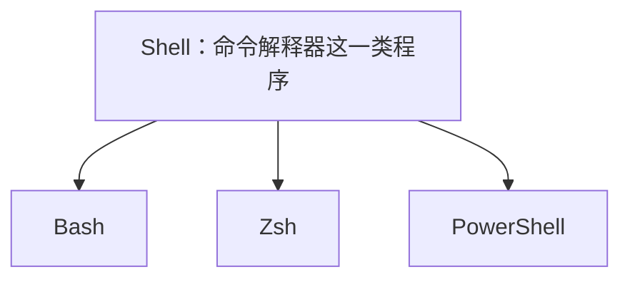

# 第 1 讲：认识 Shell，从一条命令开始

课程讲义：[2026 中文版：课程概览 + Shell 入门](https://missing-semester-cn.github.io/2026/course-shell/)。

本讲按从零学习的节奏拆成四次。**当前只学习第 1 次**，完成末尾的自检问题后，再根据实际情况继续；后面三节先作为路线图，不要求一次读完或执行全部示例。这里的命令和例子用于理解原理，不是官方练习的答案。

听英文讲解或读命令时，可以查[常用符号英文名称速查](symbols.md)，区分符号名称、读法与具体语法作用。

## 课程背景：IAP

**IAP = Independent Activities Period，自主活动期。**MIT 在秋季和春季学期之间，留出一月约四周的时间，让师生参加短课、独立研究、项目和其他活动。校历常称为 **4–1–4**：秋季约四个月、一月自主活动期、春季约四个月。“自主”强调学习安排更灵活，活动可以有老师、课堂和练习，也有学分课程。[MIT 对 IAP 的介绍](https://elo.mit.edu/iap/)

视频开头的“Missing Semester IAP 2026”表示：这是在 MIT 2026 年自主活动期中开设的 Missing Semester 课程。本课程包含九次约一小时的讲座，不计学分；课名中的“Missing Semester”呼应普通计算机课程常漏教的开发工具技能。[官方课程说明](https://missing.csail.mit.edu/2026/course-shell/)

## 第 1 次：终端里究竟是谁在做事？

**学习目标：**分清 Terminal、Shell 和被调用的程序；能指出一条简单命令中的命令名与参数。

在 Mac 上按 `Command + Space`，搜索“终端”或“Terminal”，即可打开终端应用。三个角色可以这样理解：

| 角色 | 工作 | 例子 |
|---|---|---|
| Terminal（终端） | 接收按键、显示文本，提供交互窗口 | macOS 的 Terminal 应用 |
| Shell | 解释输入的命令，执行内置功能或启动其他程序 | Bash、Zsh、PowerShell |
| 外部程序 | 接收参数或输入，完成具体任务 | `date`、`ls` |

键盘输入先经过终端交给 Shell；Shell 处理命令，程序产生的文本再显示出来。Shell 自身也是一个程序，终端窗口则可以容纳不同的 Shell。

### Shell 是类别，Bash、Zsh、PowerShell 是具体实现

这几个名称要按角色理解：**Shell 是命令解释器这一类程序的统称；Bash、Zsh、PowerShell 是其中的具体成员，彼此并列。**它们不是从底层到上层依次叠起来的组件。[微软的概念说明](https://learn.microsoft.com/en-us/powershell/scripting/what-is-a-command-shell)



**Bash = Bourne-Again SHell。**缩写取 `B` + `A` + `SH`。Bourne 是 Stephen Bourne 的姓，他编写了早期 Unix 的 Bourne Shell，通常称为 `sh`。Bourne 与英语 born 同音，born again 意为“再次诞生／重生”，名称借此双关表达与 Bourne Shell 的承接关系。正式名称写 Bourne；讲者说“Bourne-Again Shell, or Bash”时，意思是“Bourne-Again Shell，也叫／简称 Bash”。[GNU 对 Bash 的解释](https://www.gnu.org/software/bash/manual/html_node/What-is-Bash_003f.html)

**Zsh = Z Shell。**它同样能解释交互命令、执行脚本，提供命令补全、历史记录、拼写纠正等功能，注重交互便利性。它与 Bash 的许多基础用法相似，但语法和默认行为不完全相同，Bash 脚本仍要明确交给 Bash。[Zsh 官方介绍](https://zsh.sourceforge.io/Doc/Release/Introduction.html)

**PowerShell** 也是具体的 Shell，同时提供脚本语言与自动化功能。现代 PowerShell 可运行于 Windows、Linux 和 macOS；它的管道可以在命令之间传递结构化对象，Bash、Zsh 的普通管道主要传递字节流，常用于处理文本。这里先认识它的角色，具体差异在以后学习管道时再展开。[PowerShell 官方介绍](https://learn.microsoft.com/en-us/powershell/scripting/overview)

### Terminal 提供交互窗口

Terminal 是接收输入、显示文字的应用。它可以运行某个具体 Shell，例如 Zsh，也可以使用 Bash。以输入 `ls` 为例：

```text
你输入 ls
  → Terminal 把输入交给当前 Shell，例如 Zsh
  → Zsh 解释命令并启动 ls
  → ls 的输出显示在 Terminal 中
```

箭头表示这次命令的交互过程。Terminal、Shell 和外部程序都运行在操作系统上；进一步谈底层，才会涉及管理进程、文件和硬件资源的操作系统内核。Shell 有时直接执行内置命令，如 `cd`，有时启动外部程序，如 `ls`。

macOS 当前默认 Shell 是 **zsh**，课程主要用 **Bash** 讲解。本笔记的基础交互示例适用于两者，后面的脚本会明确使用 Bash，不需要现在改默认设置。[Apple 的说明](https://support.apple.com/guide/terminal/change-the-default-shell-trml113/mac)确认了这一默认值。

### 读懂提示符：`~`、`$`、`#` 与 `%`

窗口中等待你输入的那一行叫**提示符**。例如：

```text
mei@laptop:~$
```

| 部分 | 此示例中的含义 |
| --- | --- |
| `mei` | 用户名 |
| `@laptop` | 所在机器的主机名 |
| `:` 后面的 `~` | 当前目录显示为个人主目录 |
| 末尾 `$` | 传统 sh / Bash 风格中，通常表示普通、非 root 用户 |

**`~` 表示当前用户的主目录（home directory）。**例如用户 mei 的主目录在 macOS 上通常是 `/Users/mei`，在 Linux 上通常是 `/home/mei`。提示符显示 `~/Downloads` 时，表示主目录中的 Downloads 子目录。[Bash 的主目录与波浪线展开说明](https://www.gnu.org/software/bash/manual/html_node/Tilde-Expansion.html)

命令里使用半角 ASCII `~`，不要换成外形相近的全角 `～`。`cd ~` 返回主目录；`cd '~'` 会把被引号保护的 `~` 当作普通目录名，具体路径操作留到第 2 次学习。

**`$` 表示非 root、`#` 表示 root，是常见的提示符约定。**例如 Bash 的提示符转义 `\$` 会在有效用户 ID 为 0 时显示 `#`，其他情况显示 `$`。Zsh 则常用 `%` 表示普通用户，`#` 提示特权身份，常见情况为 root。[Bash 提示符说明](https://www.gnu.org/software/bash/manual/html_node/Controlling-the-Prompt.html)、[Zsh 提示符说明](https://zsh.sourceforge.io/Doc/Release/Prompt-Expansion.html)

提示符可以自定义，外观不能作为用户身份的可靠依据。可以运行 `id -u` 查看当前有效用户 ID：`0` 表示 root，其他数字表示其他用户。**root 用户是用户身份，`/` 根目录是文件系统位置**；执行 `cd /` 只改变目录，不会让你变成 root。

还要区分 `$` 的使用场景：

```text
$ echo "$HOME"
```

这是一条带提示符的示例。行首 `$` 是提示符，不需要输入；`"$HOME"` 中的 `$` 则属于命令语法，用来取变量 HOME 的值。实际输入的是 `echo "$HOME"`。它输出主目录路径，不能据此判断当前用户是否为 root。

复制示例时只复制命令，不复制用户名、目录或末尾提示符。逐条试试：

```sh
pwd
date
echo study shell
ls -l /tmp
```

`pwd` 显示当前工作目录，即当前 Shell 所在的文件夹，路径留到第 2 次细讲。`date` 显示日期时间。第三行的命令名是 `echo`，后面有 `study`、`shell` 两个参数。第四行的命令名是 `ls`，`-l` 是选项，`/tmp` 是路径参数。参数会交给命令处理；以 `-` 开头的选项通常改变行为，具体含义由命令决定。

空格通常分隔词，引用和转义可以让空格保留在同一个参数内：

```sh
echo 'study   shell'
echo "study shell"
echo study\ shell
```

单引号中的内容一般按字面保留；双引号也能保留空格，但仍允许变量等展开，后面会用到。反斜杠能保护下一个字符，此处保护空格。引号用于 Shell 解析，不会作为这些参数的一部分传给命令。普通 `echo` 会在多个参数间加入空格，因此“输出一样”不代表“参数个数一样”。

如果引号没有闭合，Shell 可能换行继续等待。此时可以按 `Ctrl + C` 取消这次输入，然后重新输入。

**现在停在这里，先想四件事：**

1. 运行 `date` 时，终端、Shell、`date` 分别负责什么？
2. `echo red blue` 和 `echo 'red blue'` 分别收到几个参数？为什么显示结果可能相同？
3. Bash、Zsh 与 PowerShell 为什么是并列关系？Terminal 又负责什么？
4. 在 `mei@laptop:~$` 中，`~` 与 `$` 各表示什么？为什么确认身份要查看 `id -u` 的结果？

## 第 2 次：我在哪里，命令又在哪里？

**学习目标：**用当前目录理解路径；知道文件操作的对象，以及 Shell 如何定位命令。

`pwd` 显示**当前工作目录**，`cd` 改变它，`ls` 查看目录内容。当前目录是 Shell 的状态，不是你在 Finder 中恰好打开的文件夹。先观察再移动：

```sh
pwd
cd ~
pwd
ls
```

路径是文件系统中的地址。以 `/` 开头的是绝对路径，从根目录出发；相对路径从当前目录出发。例如，假设当前目录是 `/Users/mei/study/shell`，`../notes` 指向 `/Users/mei/study/notes`。`.` 表示当前目录，`..` 表示上一级；`~` 在未被引号保护的位置通常由 Shell 展开为个人主目录，它与根目录 `/` 不同。路径含空格时要引用，如 `cd "$HOME/Study Notes"`，前提是该目录存在。输入路径的一部分后按 Tab，通常能得到补全或候选项。

认识文件操作即可，不必现在批量练习：

| 命令 | 用途 |
|---|---|
| `mkdir` | 创建目录 |
| `touch` | 文件不存在时创建空文件；存在时更新时间 |
| `cp` | 复制文件或目录 |
| `mv` | 移动或改名 |
| `rm` | 删除文件 |

`cp`、`mv` 的目标如果已存在，可能覆盖原内容；执行前先确认路径。查看细节可用 `ls -l`，读本机用法可用 `man ls`，在手册界面按 `q` 退出。macOS 的许多系统命令不接受 GNU 工具常见的 `--help`，遇到这种情况就查本机手册。

命令名不一定对应一个磁盘文件。`cd` 是 Shell 内置命令，因为它必须改变当前 Shell 的目录；Bash 和 zsh 中的 `echo` 通常也是内置命令，即使磁盘上还有同名程序。

```sh
type cd
type echo
type date
command -v date
printf '%s\n' "$PATH"
```

`type` 帮助判断一个名字是内置命令、别名、函数还是外部程序；`command -v` 查看当前 Shell 对命令名的解析结果，结果未必都是文件路径。因此不能只用 `which` 的输出判断一切。

需要查找外部程序时，Shell 会使用环境变量 **`PATH`**。它是一组以冒号分隔的目录，通常按顺序查找可执行文件，先找到的优先。`$PATH` 表示取出变量值；它不是“当前路径”的别名。有 `/` 的命令名，如 `./report.sh`，则直接指定路径。当前目录通常不在 `PATH` 中，这解释了为什么运行本地脚本时常写 `./`。

## 第 3 次：把文本从一个工具交给另一个

**学习目标：**认识常用文本工具；区分参数和标准输入，理解管道及重定向。

| 工具 | 先记住的作用 |
|---|---|
| `cat` | 输出文件内容 |
| `head` / `tail` | 查看开头或结尾，默认十行 |
| `grep` | 输出匹配模式的行 |
| `sort` | 按行排序；数值排序常用 `-n` |
| `uniq` | 合并相邻重复行；`-c` 统计每组数量 |
| `wc -l` | 统计换行符数量 |
| `find` | 按名称、类型等条件寻找路径 |
| `sed` / `awk` | 替换文本 / 按字段处理文本 |

尤其要记住：`uniq` **只合并相邻重复行**，不会记住此前出现过的所有内容。下面使用原创小数据，不依赖现成文件：

```sh
printf 'pear\napple\npear\n' | sort | uniq -c
```

`printf` 产生三行文本，`sort` 让相同的行挨在一起，`uniq -c` 再统计。每个工具只负责一步。`grep` 的模式通常是正则表达式；文件名中的通配符通常由 Shell 展开，两者要分开学习，见[正则表达式与通配符](regex-and-globs.md)。

程序通常具有三条标准流：**stdin（0）**接收输入，**stdout（1）**输出结果，**stderr（2）**输出错误或诊断。默认情况下输入常来自终端，后两者常显示在同一个窗口，但仍是两条流。

`A | B` 将 A 的 stdout 接到 B 的 stdin，**不会自动把 stderr 也接过去**。参数则是启动程序时交给它的词：`sort words.txt` 把文件名作为参数；`sort < words.txt` 让 Shell 将文件内容接到标准输入。这是两种不同的接口。

`> result.txt` 写 stdout 并覆盖已有文件，`>> result.txt` 追加，`2> errors.txt` 单独保存 stderr。这里先理解符号，不急着覆盖自己的文件。要试替换可先用：

```sh
printf 'draft draft\n' | sed 's/draft/ready/g'
```

末尾的 `g` 是替换表达式中的标志，表示替换每行所有匹配项，不是 `-g` 选项。这个例子只输出结果。macOS 自带的 BSD `sed` 与 GNU `sed` 的原地修改参数不同：前者不保留备份时常写 `-i ''`，后者常写 `-i`；初学先不用原地修改，查本机 `man sed` 再继续。

完整案例见 [SSH 日志管道命令详解](ssh-log-pipeline.md)：逐段解释截图中的远程日志读取与本地统计管道，配有中间输出、正则拆解与可在 Mac 上运行的模拟日志。

## 第 4 次：让命令根据结果行动

**学习目标：**理解退出码与条件判断；读懂并运行一个最小 Bash 脚本。

文本输出给人读，**退出码**则给 Shell 判断结果。`0` 通常表示成功，非零表示其他结果；具体含义要查命令说明。例如 `grep` 返回 `0` 表示找到匹配，`1` 表示没有匹配，出错又是另一种情况。用 `printf '%s\n' "$?"` 可以查看上一条命令的退出码，必须紧接着查看，之后它会被新命令更新。

`if` 根据命令的退出码选择分支，`&&` 在前项成功时运行后项，`||` 在前项失败时运行后项。判断来自退出码，不是输出中是否出现“成功”两个字。

在练习 B 组创建的临时目录内，把下面内容保存为 `greet.sh`，其中赋值的 `=` 两边没有空格：

```bash
#!/bin/bash
name='Shell learner'
if [ -n "$name" ]; then
    printf 'Hello, %s\n' "$name"
fi
```

`$name` 取出变量值，双引号保留它作为一个参数；`[ -n ... ]` 检查字符串是否非空。`[` 与参数之间、末尾 `]` 前都需要空格。`if`、`then`、`fi` 是 Shell 语法，不能把每个词都当外部程序。

先用 `bash greet.sh`：由 Bash 读取脚本，文件无需执行位。随后可用 `chmod u+x greet.sh` 为所有者增加执行权限，再用 `./greet.sh`。直接执行时，首行 **shebang** 指定解释器 `/bin/bash`；它不是把脚本文本接到 stdin 的重定向。

完成这个脚本后，再认识有限循环：

```bash
for tool in shell git; do
    printf 'Learning %s\n' "$tool"
done
```

`for` 让变量 `tool` 依次取列表里的值，并执行 `do` 与 `done` 之间的命令。这一例会执行两次。`$(命令)` 则把命令的标准输出放进当前命令，例如 `today=$(date +%Y-%m-%d)` 把日期存入变量 `today`。先理解这两个小结构，再做 D 组练习。

脚本还能接收参数：运行 `bash check.sh 'My Notes/note.txt'` 时，`$1` 是传入的第一个参数，`$#` 是参数个数；没有传参数时，个数为 `0`。使用 `"$1"` 保留文件名里的空格。`test -f "$1"` 或 `[ -f "$1" ]` 检查该路径是否存在且为普通文件，可把这个检查作为 `if` 的条件。需要观察实际执行步骤时，用 `bash -x check.sh ...`；它会在执行前显示展开后的命令。

后台任务与严格模式留到后续具体任务中，再逐步展开。

## 来源与许可

本笔记以用户提供的[第一讲英文字幕](../source/01-shell.en.srt)与 [2026 年官方第一讲](https://missing.csail.mit.edu/2026/course-shell/)核对，中文字幕用于辅助对照，基于 **Anish Athalye、Jon Gjengset、Jose 团队**的 The Missing Semester 课程改写。术语与示例按学习需要重新组织，并校正了字幕转写及平台差异；具体转写问题见[字幕校正记录](../source/01-shell-video.md)。本课程目录中的改写内容采用 [CC BY-NC-SA 4.0](https://creativecommons.org/licenses/by-nc-sa/4.0/)；转载或改编时请保留署名、来源和相同许可，并遵守非商业使用条件。
